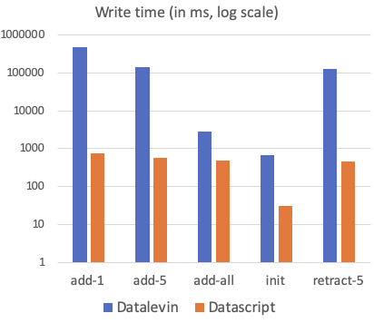

<p align="center"></img></p>
<h1 align="center">Datalevin</h1>
<p align="center"> 🧘 Simple, fast and durable Datalog database for everyone 💽 </p>
<p align="center">
<a href="https://clojars.org/datalevin"></img></a>
</p>

## :hear_no_evil: What and why

> I love Datalog, why hasn't everyone use this already?

Datalevin is a port of [Datascript](https://github.com/tonsky/datascript) in-memory Datalog database to [Lightning Memory-Mapped Database (LMDB)](https://en.wikipedia.org/wiki/Lightning_Memory-Mapped_Database).

The rationale is to have a simple, fast and free Datalog query engine running on durable storage.  It is our observation that many developers prefer the flavor of Datalog popularized by [Datomic®](https://www.datomic.com) over any flavor of SQL, once they get to use it. Perhaps it is because Datalog is more declarative and composable than SQL, e.g. the automatic implicit joins seem to be its killer feature.

Datomic® is an enterprise grade software, and its feature set may be an overkill
for some use cases. One thing that may confuse casual users is its [temporal
features](https://docs.datomic.com/cloud/whatis/data-model.html#time-model). To
keep things simple and familiar, Datalevin does not store transaction history,
and behaves the same way as most other databases: when data are deleted, they
are gone.

Datalevin retains the library property of Datascript, and it is meant to be
embedded in applications to manage state. Because data is persistent on disk in
Datalevin, application state can survive application restarts, and data size can
be larger than memory.

Datalevin relies on the robust ACID transactional database features of LMDB. Designed for concurrent read intensive workloads, LMDB is used in many projects, e.g. [Cloudflare](https://blog.cloudflare.com/introducing-quicksilver-configuration-distribution-at-internet-scale/) global configuration distribution. LMDB also [performs well](http://www.lmdb.tech/bench/ondisk/) in writing large values (> 2KB). Therefore, it is fine to store documents in Datalevin.

Datalevin uses cover index and has no write-ahead log, so once the data are
written, they are indexed. In the standalone mode, there are no separate processes or threads for
indexing, compaction or doing any database maintenance work that compete with
your applications for resources.

By giving up the "database as a value" doctrine adopted by the alternatives,
Datalevin is able to leverage caching aggressively, achieving significant query speed advantage.

Independent from Datalog, Datalevin can also be used as a fast key-value store for [EDN](https://en.wikipedia.org/wiki/Extensible_Data_Notation) data. A number of optimizations are put in place. For instance, it uses a transaction pool to reuse transactions, pre-allocates read/write buffers, and so on.

## :tada: Usage

Use as a Datalog store:

```clojure
(require '[datalevin.core :as d])

;; define a schema
(def schema {:aka  {:db/cardinality :db.cardinality/many}
             ;; :db/valueType is optional, if unspecified, the attribute will be
             ;; treated as EDN blobs
             :name {:db/valueType :db.type/string
                    :db/unique    :db.unique/identity}})

;; create DB and connect to it
(def conn (d/create-conn schema "/tmp/datalevin-test"))

;; transact some data
;; notice :nation is not defined in schema, so it will be treated as an EDN blob
(d/transact! conn
             [{:name "Frege", :db/id -1, :nation "France", :aka ["foo" "fred"]}
              {:name "Peirce", :db/id -2, :nation "france"}
              {:name "De Morgan", :db/id -3, :nation "English"}])

;; query the data
(d/q '[:find ?nation
       :in $ ?alias
       :where
       [?e :aka ?alias]
       [?e :nation ?nation]]
     @conn
     "fred")
;; => #{["France"]}

;; close conn
(d/close conn)
```

Use as a key value store:
```clojure
(require '[datalevin.lmdb :as l])

;; open a key value DB
(def db (l/open-lmdb "/tmp/lmdb-test"))

;; define a table (dbi) name
(def table "test-table")

;; open the table
(l/open-dbi db table)

;; transact some data, a transaction can put data into multiple tables
(l/transact db
            [[:put table :datalevin "Hello, world!"]
             [:put table 42 {:saying "So Long, and thanks for all the fish"
                             :source "The Hitchhiker's Guide to the Galaxy"}]])

;; get the value with the key
(l/get-value db table :datalevin)
;; => "Hello, world!"
(l/get-value db table 42)
;; => {:saying "So Long, and thanks for all the fish", :source "The Hitchhiker's Guide to the Galaxy"}

;; delete some data
(l/transact db [[:del table 42]])

;; now it's gone
(l/get-value db table 42)
;; => nil

;; close db
(l/close db)
```

Refer to the [API documentation](https://juji-io.github.io/datalevin/index.html) for more details.

## :rocket: Status

Both Datascript and LMDB are mature and stable libraries. Building on top of
them, Datalevin is extensively tested with property-based testing. Running the
benchmark suite of Datascript, here is how it looks.

<p align="center">
</img>
</img>
</p>

In all benchmarked queries, Datalevin is faster than Datascript. Considering
that we are comparing a disk store with a memory store, this result may be
counter-intuitive. The primary reason is that Datalevin is not an immutable
database, so it is easy to cache aggressively, whereas it may be difficult in an immutable
database (e.g. see [this issue](https://github.com/tonsky/datascript/issues/6)). Before we introduced
caching in version 0.2.8, Datalevin was only faster than Datascript for single
clause queries due to the highly efficient reads of LMDB. With caching enabled,
Datalevin is now faster across the board.

Writes can be a few orders of magnitude slower, as expected, as Datalevin
is writing to disk while Datascript is in memory. The bulk write speed is
good, writing 100K datoms to disk in less than a second; the same data can also be transacted as a whole in less than 3 seconds.

If transacting one datom or a few datoms at a time, it is much slower. Each
transaction syncs to disk, so it is inherently slow. Because LMDB does copy on
write and never overwrites data that are being read, large write amplification
may also occur. The advice is to write data in larger batches.

In short, Datalevin is quite capable for small or medium projects right now.

## :earth_americas: Roadmap

These are the short term goals that we will try to reach quickly:

* 0.3.0 Distributed mode with raft based replication
* 0.4.0 Schema migration
* 0.5.0 Query parity with Datascript: composite tuples and persisted transaction functions
* 0.6.0 Statistics collector
* 0.7.0 Query optimizer
* 0.8.0 Materialized views and incremental maintenance

We welcome any suggestions on what to do next. Please file issues.

## :floppy_disk: Differences from Datascript

Datascript is developed by [Nikita Prokopov](https://tonsky.me/) that "is built
totally from scratch and is not related by any means to" Datomic®. Although a
port, Datalevin differs from Datascript in more significant ways than just the difference in data durability:

* As mentioned, Datalevin is not an immutable database, and there is no "database as a value" feature.  Since history is not kept, transaction ids are not stored.

* Datoms in a transaction are committed together as a batch, rather than being saved by `with-datom` one at a time.

* Respects `:db/valueType`. Currently, most [Datomic® value types](https://docs.datomic.com/on-prem/schema.html#value-types) are supported, except bigint, bigdec, uri and tuple. Values with unspecified type are treated as [EDN](https://en.wikipedia.org/wiki/Extensible_Data_Notation) blobs, and are de/serialized with [nippy](https://github.com/ptaoussanis/nippy).

* Has a value leading index (VAE) for datoms with `:db.type/ref` type attribute; The attribute and value leading index (AVE) is enabled for all datoms, so there is no need to specify `:db/index`. These are the same as Datomic® Cloud.

* Attributes are stored in indices as integer ids, thus attributes in index access are returned in attribute creation order, not in lexicographic order (i.e. do not expect `:b` to come after `:a`). This is the same as Datomic®.

* Has no features that are applicable only for in-memory DBs, such as DB as an immutable data structure, DB serialization, DB pretty print, filtered DB, etc. For now, [LMDB tools](http://www.lmdb.tech/doc/tools.html) can be used to work with the database files.

This project would not have started without the existence of Datascript, we will
continue submitting pull requests to Datascript with our improvements where they
are applicable to Datascript.

## :baby: Limitations

* Attribute names have a length limitation: an attribute name cannot be more than 511 bytes long, due to LMDB key size limit.

* Because keys are compared bitwise, for range queries to work as expected on an attribute, its `:db/valueType` should be specified.

* The maximum individual value size is 4GB. In practice, value size is determined by LMDB's ability to find large enough continuous space on disk and Datelevin's ability to pre-allocate off-heap buffers in JVM for them.

* The total data size of a Datalevin database has the same limit as LMDB's, e.g. 128TB on a modern 64-bit machine that implements 48-bit address spaces.

* There's no network interface as of now, but this may change.

* Currently only supports Clojure on JVM, but adding support for other Clojure-hosting runtime is possible in the future, since bindings for LMDB exist in almost all major languages and available on most platforms.

## :shopping: Alternatives

If you are interested in using the dialect of Datalog pioneered by Datomic®, here are your current options:

* If you need time travel and rich features backed by the authors of Clojure, you should use [Datomic®](https://www.datomic.com).

* If you need an in-memory store, e.g. for single page applications in a browser, [Datascript](https://github.com/tonsky/datascript) is for you.

* If you need features such as bi-temporal graph queries, You may try [Crux](https://github.com/juxt/crux).

* If you don't mind experimental storage backend, you may try [Datahike](https://github.com/replikativ/datahike).

* There was also [Eva](https://github.com/Workiva/eva/), a distributed store, but it is no longer in active development.

* If you need a simple and fast durable store with a battle tested backend, give [Datalevin](https://github.com/juji-io/datalevin) a try.

Version: 0.2.14

## License

Copyright © 2020 Juji Inc.

Licensed under Eclipse Public License (see [LICENSE](LICENSE)).
