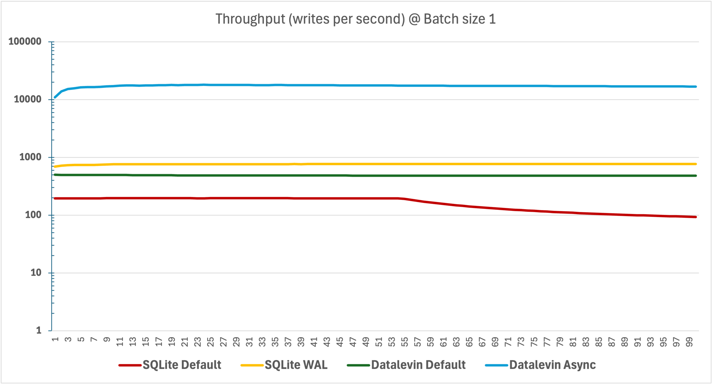
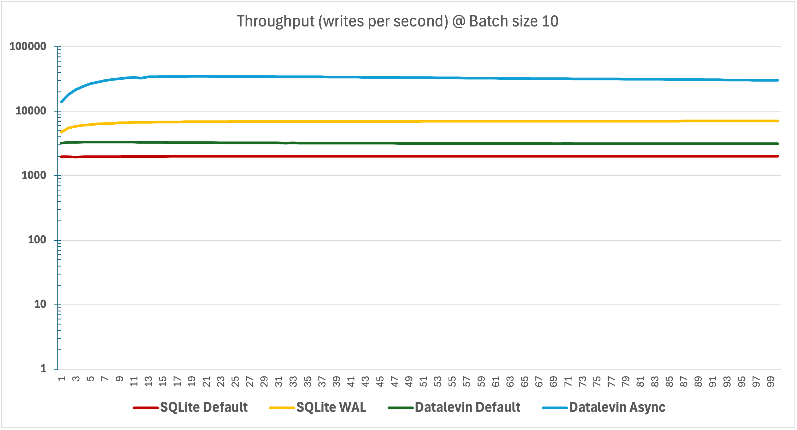
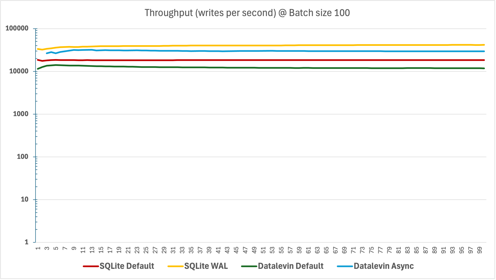
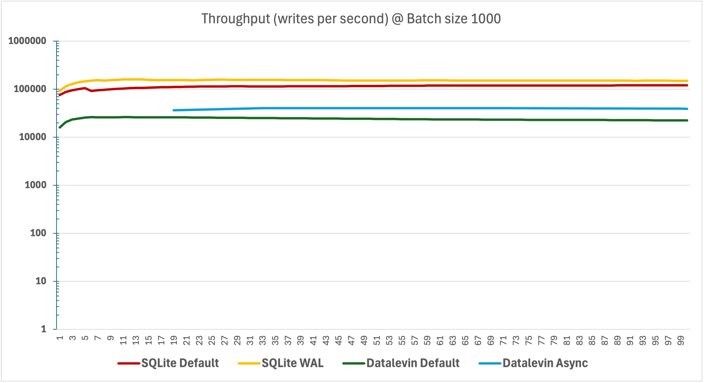
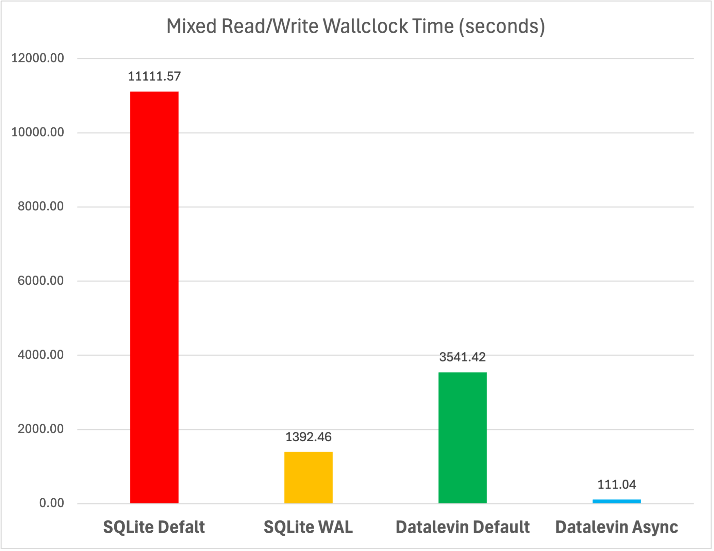
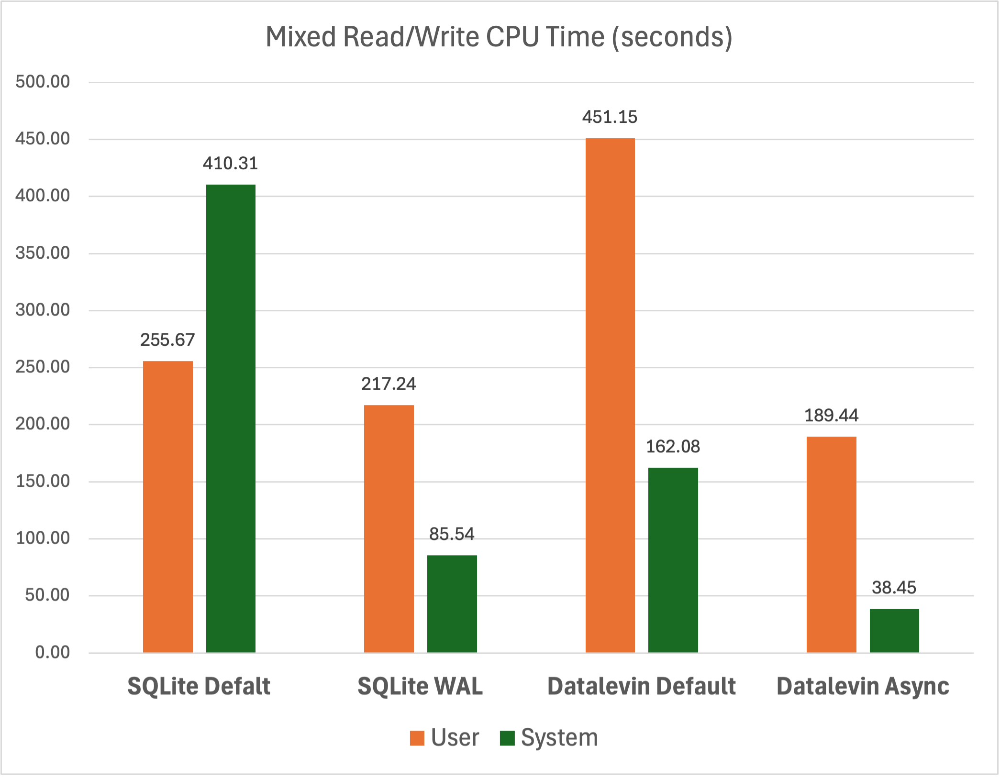

# Write Benchmark (WIP)

The purpose of this benchmark is to study the write throughput and latency under
various conditions in Datalevin. Hopefully, this gives users some reference data
points to help choosing the right transaction function and the right data batch
size for specific use cases.

We also compare Datalevin's transaction speed with SQLite, as it is the most
widely deployed embedded database that has a reputation for being fast.

## Setup

The benchmark is conducted on a 2016 Intel Core i7-6850K CPU @ 3.60GHz with 6
cores, 64GB RAM, Samsung 860 EVO 1TB SSD.

The OS is x86_64 GNU/Linux 6.1.0-31-amd64 #1 SMP PREEMPT_DYNAMIC Debian
6.1.128-1 (2025-02-07), running OpenJDK version "17.0.14" 2025-01-21, and
Clojure version is 1.12.0. Datalevin is version 0.9.19. SQLite is from SQLite
JDBC driver 3.48.0.0, using next.jdbc Clojure library 1.3.981.

### Tasks

There are two tasks that are done sequentially.

#### Pure Write

The first task writes a 8 bytes integer as key and a 36 bytes random UUID string
as value. In Datalevin, this means an entitiy of two attributes, one is a long,
marked as `:db.unique/identity`, and the other a string. In SQLite, this is a
row of two fields, one is an integer `PRIMARY KEY`, and another a `TEXT`.

The pure write task is to do 1 million such writes to an empty DB. The integers
are all even numbers between 1 and 2 millions, so the next task can have 50%
chance of hitting existing data initially.

The writes can be batched to improve throughput as it reduces the number of disk
flush calls. We vary the batch sizes in this task: 1, 10, 100, and 1000, to
test the batching speed up effect.

#### Mixed Read/Write

With 1 million entities in DB, we then do 2 million additional operations, with
1 million reads and 1 million writes. Read and write are interleaved. These
reads/writes are individual operations, not batched.

The read/write integers are random number between 1 and 2 millions. So initally
write has a 50% chance of being an append and 50% chance of being an
overwrite. The chance of being an overwrite increases as more items are
written.

### Metrics

For every 10K write requests, a set of metrics are recorded:

* Throughput (writes/second), average throughput at the moment.
* Call Latency (milliseconds), average latency of write function calls.
* Commit Latency (milliseconds), average latency of transaction commits.

The results are written into a CSV file.

For asynchronous transactions, the metrics are recorded after `deref` is called
on the last future, which blocks until all data has actually been written.

For consistency and to avoid exhausting system resources, the number of
asynchronous write requests in flight is capped at 1000 using a Semaphore.

At the end of the benchmark, the total number of data items on disk is also
queried to verify that all data are written, otherwise the benckmark will report
an error.

### Run

Clojure command line is needed to run the benchmarks.

For example, the command below runs pure write benchmark for `transact-async`
with batch size 10, and save the results in `dl-async-10.csv`:

```bash
time clj -Xwrite :base-dir \"/tmp/dl/\" :batch 10 :f dl-async > dl-10-async.csv
```

This command runs mixed read/write benchmark following the pure write task above:

```bash
time clj -Xmixed :dir \"/tmp/dl/dl-async-10\" :f dl-async > dl-10-async-mixed.csv
```

The command below runs pure write benchmark for Sqlite `INSERT`  with batch size
1, and save the results in `sqlite-1.csv`

```bash
time clj -Xwrite :base-dir \"/tmp/sql/\" :batch 1 :f sql-tx > sqlite-1.csv
```

This command runs the read/write mixed task following the pure write above:

```bash
time clj -Xmixed :dir \"/tmp/sql/sqlite-1\" :f sql-tx > sqlite-1-mixed.csv
```

The total wall clock time, system time and user time are also recorded.

## Datalog Transaction

Because Datalog store of Datalevin is intended to be an operational database, we
test the default durable write condition (i.e. each commit synchronously flushes
to disk) in Datalevin. Correspondingly, we test the same default
`PRAGMA synchronous=FULL` write condition in SQLite.

### Write Conditions

Datalevin has two Datalog transaction functions:

* `transact!`
* `transact-async`

Both are durable by default. In the case of `transact-async`, the returned
future is only realized after the data are flushed to disk. Both are tested.

`transact` is just the blocked version of `transact-async` so it is not tested.
There are two faster `init-db` and `fill-db` functions that directly load
prepared datoms to bypass the expensive process of verifying integrity of
everything. These are not formally tested in this benchmark, as we are only
interested in transactions of raw data.

SQLite also have two durable transaction mode: default and WAL mode, and both
are tested.

### Results

We presents throughput and commit latency. The call latencies are close to
commit latencies in synchronous writes, while close to zero for asynchronous
writes. So call latencies are omitted from this presentation.

#### Pure Write Task

We plotted the accumulated throughput for each batch size. The Y axis (writes
per second) is on the log scale. The X axis is every 10000 writes per tick.

##### Batch size 1 throughput

<p align="center">
</img>
</p>

When data are not batched, Datalevin default writes are much faster than
SQLite's default, and Datalevin async writes are much faster than SQLite's WAL
mode. At one million writes mark, the throughput numbers (writes per second)
are:

|SQLite Default|SQLite WAL|Datalevin Default|Datalevin Async|
|---|---|---|---|
|93.5|770.2|482.5|16829.2|

##### Batch size 10 throughput

<p align="center">
</img>
</p>

When data are batched at size 10, the same relative positions remain, but the
gaps narrow.

At one million writes, the throughput numbers (writes per second) are:

|SQLite Default|SQLite WAL|Datalevin Default|Datalevin Async|
|---|---|---|---|
|2006.8|7074.7|3141.5|30132.2|

##### Batch size 100 throughput

<p align="center">
</img>
</p>

At batch size 100, SQLite's default mode writes are now faster than Datalevin's
default writes, and WAL mode is faster than async writes.

Notice that Datalevin's async writes at batch 100 are not faster than
that of batch size 10.

At one million writes, the throughput numbers (writes per second) are:

|SQLite Default|SQLite WAL|Datalevin Default|Datalevin Async|
|---|---|---|---|
|18448.8|41583.5|11806.8|29416.8|

##### Batch size 1000 throughput

<p align="center">
</img>
</p>

At batch size 1000, SQLite's default writes are now faster than Datalevin's
Async writes in all cases.

At one million writes, the throughput numbers (writes per second) are:

|SQLite Default|SQLite WAL|Datalevin Default|Datalevin Async|
|---|---|---|---|
|120496.4|149588.6|22400.9|39231.6|

##### Average commit latency

The average latency of commits (milliseconds) for all conditions are plotted:

<p align="center">
</img>
</p>

Datalevin's commit latency goes up as the batch size goes up. The same pattern
is with WAL mode. On the other hand, SQLite's default has a sweet spot at batch
size 10.

None of SQLite's commit latency goes under 1 milliseconds, while Datalevin's
Async transaction can go way below 1 milliseconds at batch size 1 and 10.

#### Fixed Read/Write Task

The wallclock time to finish the 2 millions mixed reads/writes is plotted on
the left, and the CPU times are plotted at right:

<p align="center">
</img>
</img>
</p>

For mixed read/write task, Datalevin default is much faster than SQLite default,
Datalevn Async is much faster than SQLite WAL, while SQLite WAL is faster than
Datalevin default.

As to CPU time, the differences among different conditions are not big. We can
see that Aysnc in Datalevin and WAL mode in SQLite do save CPU time compared
with respective default conditions.

Notice that most of the time is spent on waiting for I/O for the three
synchronous conditions, where CPU times are relatively small compared with the
wallclock time. The exception is Datalevin Async, where the total CPU
time (227.89 seconds) is actually greater than wallclock time (111.04 seconds),
indicating the effective utilization of multicore and the apparent hiding of I/O
wait time.

### Remark

In general, Datalevin's transaction speed is more stable and less sensitive to
batch size variations. Particularly, the throughput of Async transaction
hovers around 15k to 40k per second regardless the batch sizes. SQLite is very
good at batch transaction, but individual transaction fails short.

It should be mentioned that for bulk loading of large amount of data,  Datalevin
has the option to use `init-db` and `fill-db` functions. For example, it took 5.3
seconds to load this data set using `init-db` and `fill-db`.

Note that Datalevin build index at data load time so it is maintenance free,
whereas SQLite does not build index at transaction time so users have to manage
indices.

## Key Value Transaction

Datalevin wrap LMDB to offer KV store feature. Here we do not compare Datalevin
with other KV stores, as there are plenty of such comparison between LMDB and
others KV stores already.

We study the throughput and latency of KV writes under different combination of
transact function and env flags, using the same tasks as above. For pure write
task, we write 1 million pairs of key and value; 2 millions of reads/writes for
mixed read/write task, the same as Datalog transaction.

### Write Conditions

Datalevin supports these transaction functions for key value store:

* `transact-kv`
* `transact-kv-async`

In addition to the default durable write condition, Datalevin supports some
faster, albeit less durable writes, by setting one of these env flags:

* `:nometasync`
* `:nosync`
* `:writemap` + `:mapasync`

We are interested in these non-durable write conditions, because there are many
good use cases for a fast non-durable KV store, such as caching, session
management, temporary data storage, real-time analytics, message queues,
configuration, leaderboards, and so on.

### Results

#### Pure Write Task

#### Mixed Read/Write Task

### Remark
